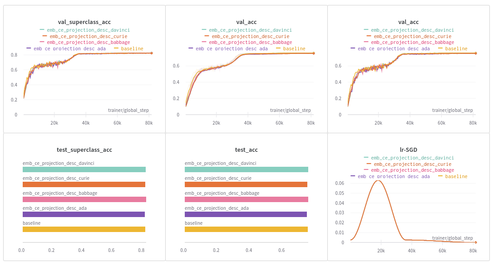
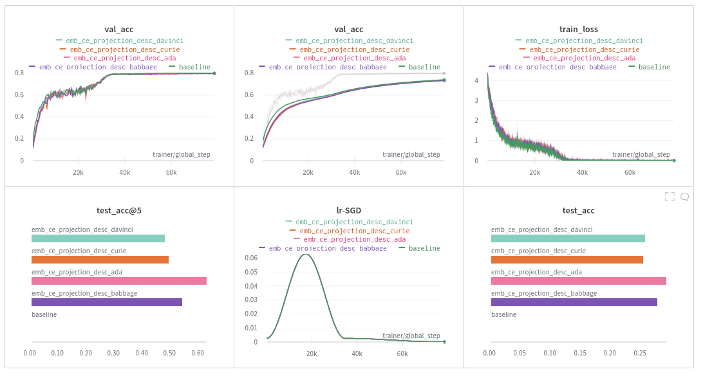

# Using large language model embeddings as targets 

In this repo we investigated the utility of embedding the class labels of a classification task (e.g., CIFAR100) using GPT3.
In particular, we were interested whether the GPT3 embeddings of class labels serve as better targets for classification models, and,
whether they can be used to obtain zero-shot performance. 

The general approach is to embed the strings corresponding to the class labels or descriptions of the class labels using GPT3 and 
using the resulting embedding vectors as the targets for training a neural network (NN), e.g., a CNN. Once the NN is trained, 
it can be used to classify images by comparing their NN embedding to all the class label embeddings and assigning the closest
one. 

## CIFAR100 label embeddings

Looking at the class label embeddings using OPENAI's `'text-similarity-davinci-001'` model 
it seems like the GPT3 embeddings contain information relevant to the task. Semantic similarity 
between class labels seems to be captured by their embeddings reasonably well. This can be seen
both from the crosscorrelation matrix of the class label embeddings:


and from a TSNE plot:


## Better performance using GPT3 embeddings as targets?

In my experiments using the GPT3 embeddings as targets did not improve the classification accuracy on CIFAR10 and CIFAR100.
The modified model achieves about the same accuracy as the baseline from which we started. Here are some results for CIFAR100:



https://wandb.ai/dfstransformer/cifar100_scacc/reports/CIFAR100-one-hot-vs-GPT3-embedding-targets--VmlldzoyODkxNDA2

## Zero-shot performance?

However, training on the GPT3 embeddings results in some non-negligible zero-shot classifiation performance.
Here we split the dataset such that the training and the test labels are disjunct. Every 5th class goes into the test set, 
resulting in a training set containing 80 classes and a test set containing 20 classes.



https://wandb.ai/dfstransformer/cifar100_zeroshot/reports/CIFAR100-zero-shot-experiment--VmlldzoyODkxNDQx

# Installation

```bash
conda create -n lm_labels python=3.9
pip install -r requirements.txt
```

# Example usage

E.g., you can rerun the zero-shot experiment:

```bash
python src/train.py --yaml hyperparams/cifar100_zeroshot/projection.yaml --wandb_project cifar100_zeroshot --wandb_name emb_ce_projection
```

