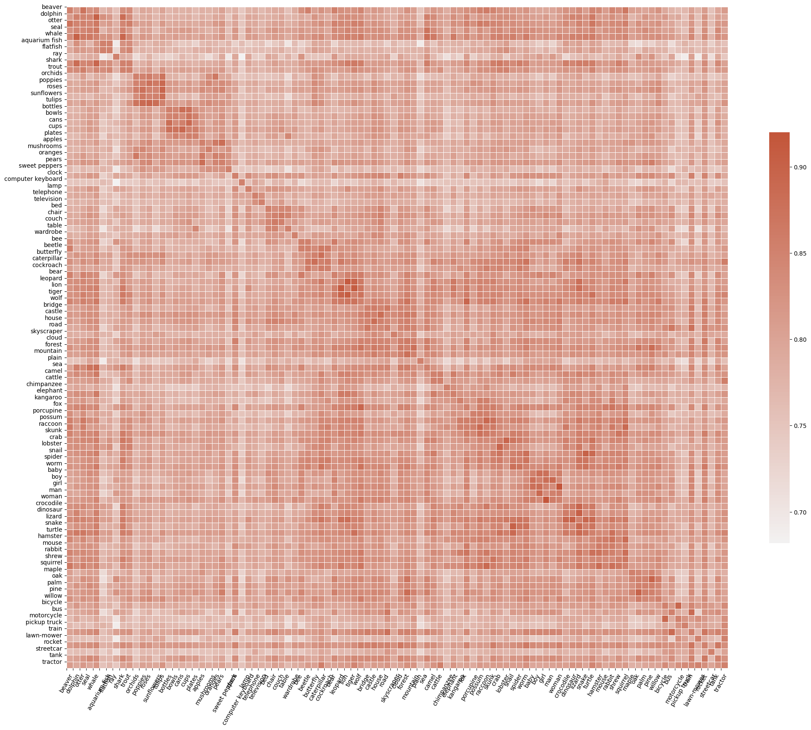
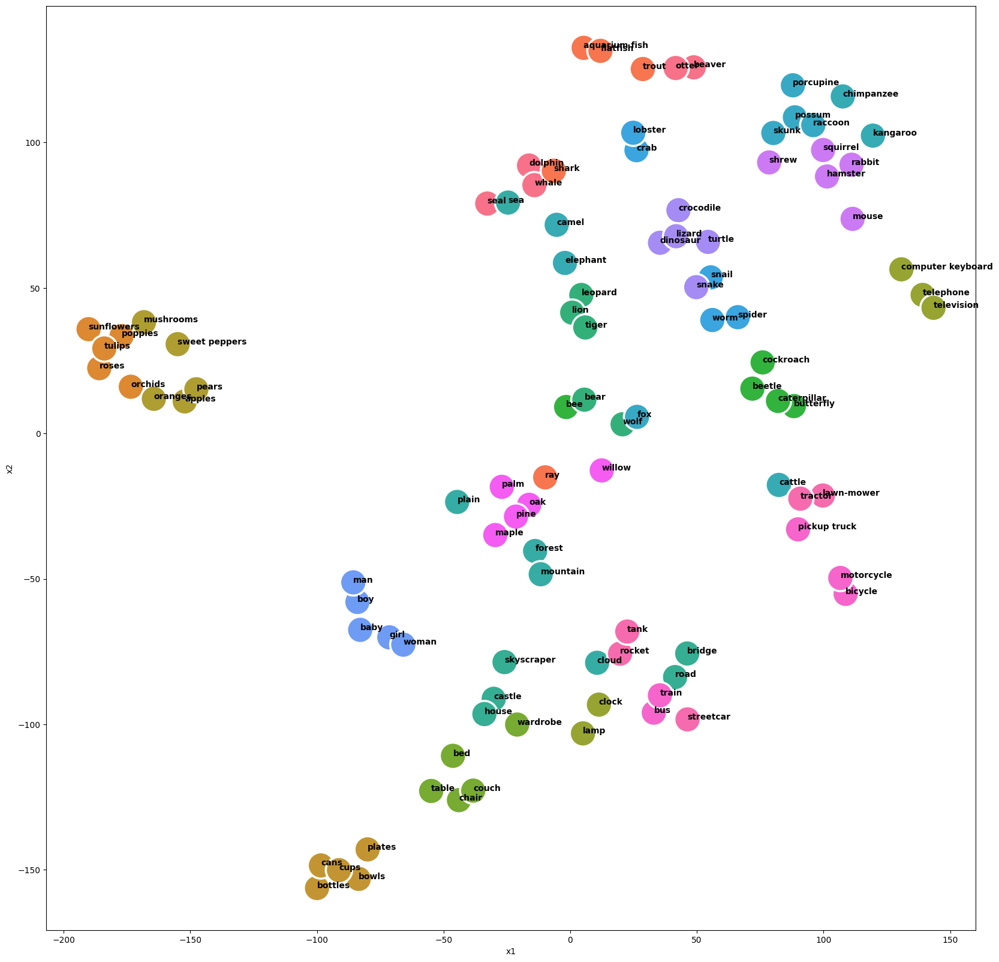

# Using Large Language Model Embeddings as Targets 

In this repo I investigated the utility of embedding the class labels of a classification task (e.g., CIFAR100) using GPT3.
In particular, I was interested whether the GPT3 embeddings of class labels serve as better targets for classification models, and,
whether they can be used to obtain zero-shot performance.  

## CIFAR100 label embeddings

Looking at the class label embeddings using openai's `'text-similarity-babbage-001'` model 
it seems like the GPT embeddings contain information relevant to the task. Semantic similarity 
between class labels seems to be captured by their embeddings reasonably well. This can be seen
both from the crosscorrelation matrix of the class label embeddings:



and from a TSNE plot:



# Installation

```bash
conda create -n lm_labels python=3.9
pip install -r requirements.txt
```

# Example usage

```bash
python src/train.py
```

